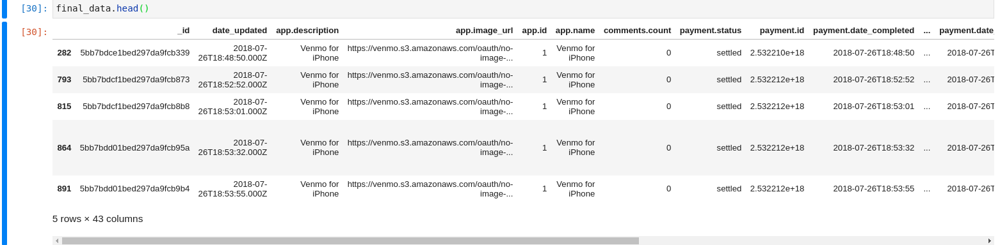

# Creepathon

 

    

 

We used [this venmo data set](https://github.com/sa7mon/venmo-data) to extract discover what **creepy** personal information we could find in a public dataset.

## 🚀&nbsp; Installation and Documentation

This [tutorial](https://docs.mongodb.com/manual/tutorial/install-mongodb-on-os-x/) explained perfectly how to set MongoDB up on our Codam iMacs

By default, creepathon.py sets up a connection with mongodb at localhost:27017 without authentication.
You can use this script or build on top of it, to download the entire chunk of data or aggregate it into smaller parts.
Please read the documented code to see exactly what the code does and how it works

## ❤️&nbsp; Community

This entire project is **open source**. We have taken inspiration and used code from other open source projects,
so it's only natural we open our code to you as well.
We wouldn't have it any other way!

## 📫&nbsp; Have a question? Want to chat? Ran into a problem?

We are happy to answer your questions via [GitHub Discussions](https://github.com/pde-bakk/Creepathon/discussions)! Obviously you can always **reach out to us directly** via the 42slack.

## 🤝&nbsp; Found a bug? Missing a specific feature?

Feel free to **file a new issue** with a respective title and description on [our Issues page](https://github.com/pde-bakk/Creepathon/issues). If you already found a solution to your problem, **we would love to review your pull request**!

## 📘&nbsp; License
The Sulu content management system is released under the under terms of the [MIT License](LICENSE).